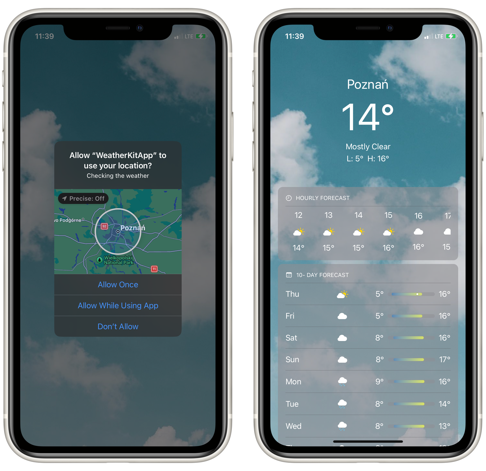
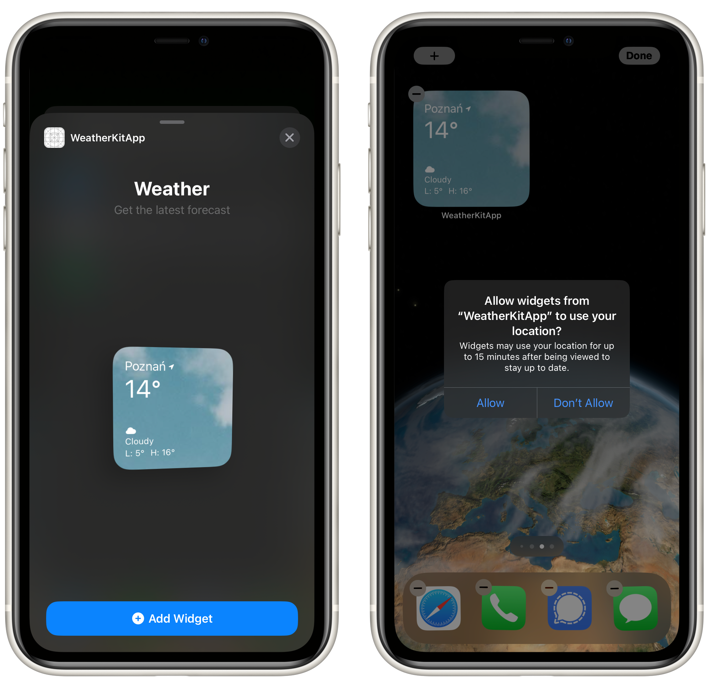
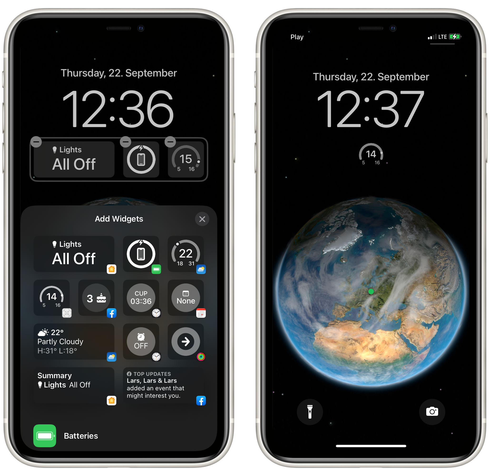

# SwiftUI-Weather-App

>WeatherKit brings valuable weather information to your apps and services through a wide range of data that can help people stay up to date, safe, and prepared. It’s easy to use WeatherKit in your apps for iOS 16, iPadOS 16, macOS 13, tvOS 16, and watchOS 9 with a platform-specific Swift API.\
Access to WeatherKit is included in the Apple Developer Program, which also provides all the tools, resources, and support you need to develop and distribute apps — including access to beta software, app services, testing tools, app analytics, and more.


 <h3>Requesting Location And Weather</h3>
  <p align="center">
  
</p>

>Using async/await
```func requestWeatherForCurrentLocation() async {
       guard let userLocation = locationManager.userLocation else { return }
        do {
            weather = try await WeatherService.shared.weather(for: userLocation)
        } catch {
            print("\(error.localizedDescription)")
            weather = nil
        }
    }
```

 <h3>Homescreen Widget</h3>
  <p align="center">
  
</p>

 <h3>Lock Screen Widget- New in iOS 16</h3>
  <p align="center">
  
</p>


## Tech
  - SwiftUI
  - Core Location
  - WidgetKit
  - WeatherKit
 
